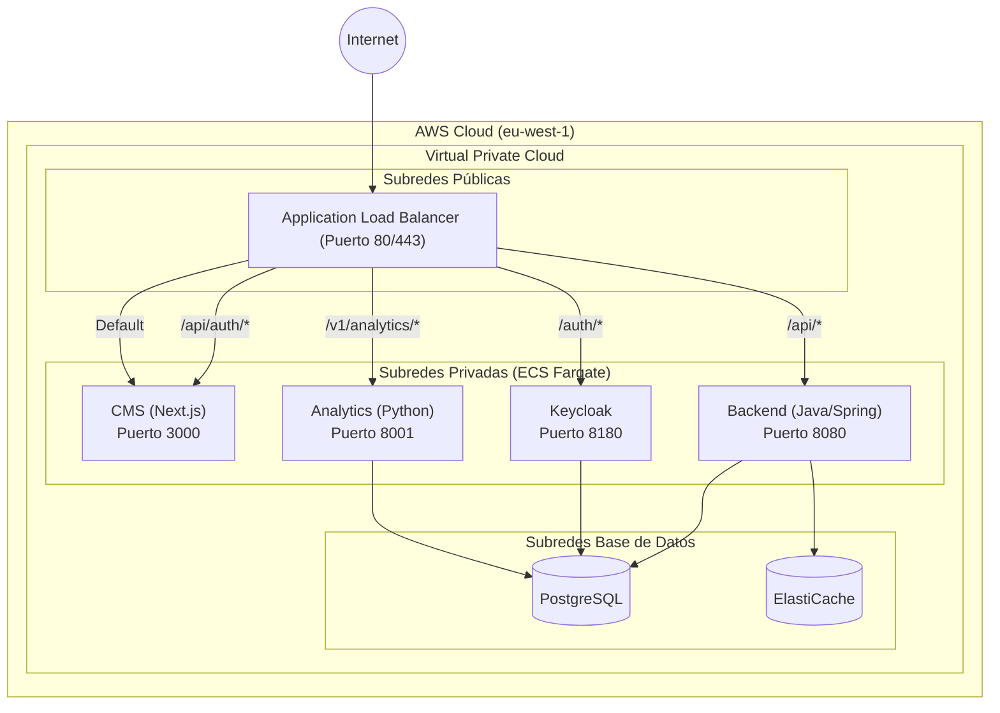
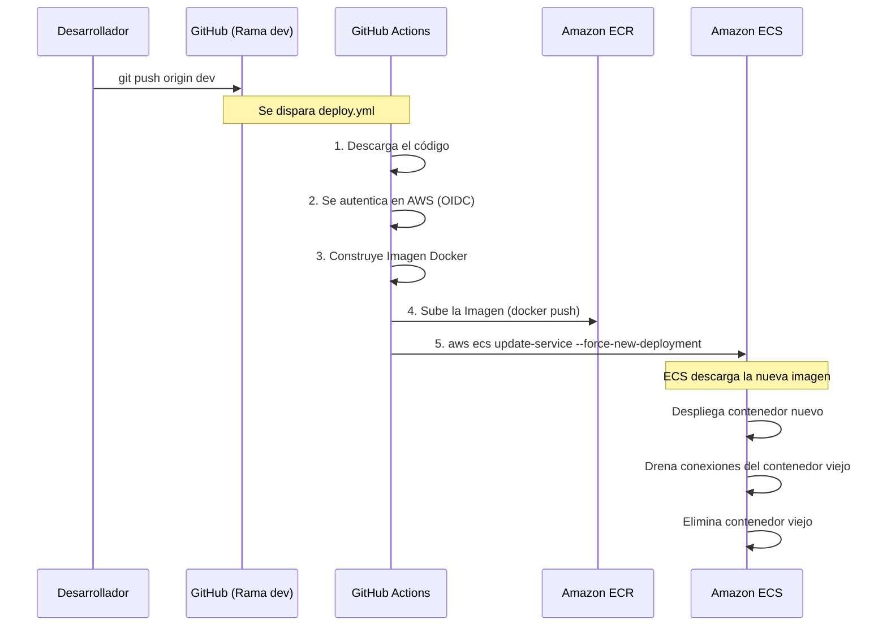

# Arquitectura y DevOps de Auren

Este documento describe la infraestructura actual desplegada en AWS y el flujo de trabajo DevOps (CI/CD) para la plataforma Auren.

## 1. Arquitectura de AWS

La plataforma utiliza una arquitectura orientada a microservicios alojados en **AWS ECS (Fargate)**, que proporciona ejecución de contenedores sin necesidad de administrar servidores subyacentes.

### Reglas de Enrutamiento (ALB)
El Load Balancer distribuye el tráfico basándose en la ruta de la petición:
- `/api/auth/*` ➔ **CMS** (NextAuth)
- `/v1/analytics/*`, `/v1/copilot/*` ➔ **Analytics**
- `/api/*`, `/ws/*` ➔ **Backend**
- `/auth/*`, `/realms/*`, `/admin/*` ➔ **Keycloak**
- Por defecto (todo lo demás) ➔ **CMS**

---

## 2. Flujo DevOps (CI/CD)

El sistema de CI/CD está construido con **GitHub Actions**. Dado que Auren es un conjunto de repositorios (CMS, Backend, Analytics, Infrastructure, Mobile), cada uno tiene su propio ciclo de vida.

### Estrategia de Ramas (Git Flow)

Actualmente, tienes configurado un entorno de **Pre-producción**. En un futuro, el flujo recomendado será:

1. **`feat/*`, `fix/*` (Ramas de trabajo)**
   - Desarrollo local.
2. **`dev` (Pre-producción / Staging)**
   - Se integran las nuevas *features* mediante un *Pull Request* hacia `dev`.
   - Al fusionar a `dev`, GitHub Actions despliega automáticamente a tu entorno de pre-producción en AWS.
   - Aquí se realizan pruebas de integración y QA.
3. **`main` (Producción)**
   - Cuando la rama `dev` es estable y se aprueba una "Release", se hace un *Pull Request* de `dev` a `main`.
   - Al fusionar a `main`, otro archivo de GitHub Actions desplegará la versión a la infraestructura definitiva de Producción (que estará aislada, posiblemente en otra cuenta de AWS o VPC, con sus propias bases de datos y dominios en HTTPS).

### Seguridad en la Integración
- **OIDC (OpenID Connect):** GitHub Actions no utiliza claves estáticas ni contraseñas almacenadas de AWS. Se autentica asumiendo el rol temporal `auren-preprod-github-actions-role` mediante certificados de confianza, lo cual es la mejor práctica de seguridad (Zero Trust).
- **Subredes Privadas:** Los contenedores ECS no tienen IPs públicas. Nadie en internet puede atacar a tu base de datos ni a Keycloak directamente saltándose el Load Balancer.
- **Red de Bases de Datos:** RDS y Redis residen en sus propios grupos de seguridad (Security Groups) que bloquean todo el tráfico excepto el proveniente específicamente del clúster de ECS.
